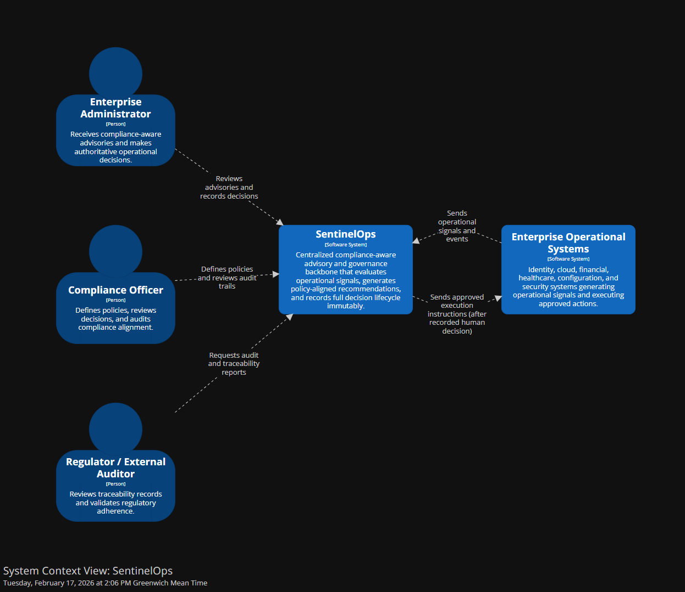

# Phase 1: System Context Architecture

## C4 Level 1: SentinelOps as a Centralized Compliance Backbone

---

## 1. Architectural Positioning

SentinelOps operates as a **centralized governance intelligence layer** across enterprise systems.

**It does not sit inside operational systems.**

**It observes them, evaluates actions against policy, advises administrators, and records decision chains.**

All regulated operational domains integrate into SentinelOps as signal providers and execution receivers.

---

## 2. Primary Actors

### Enterprise Administrator

- **Receives compliance aware advisories**
- **Makes operational decisions**
- **Provides explicit authority**
- **Is accountable**

### Compliance Officer

- **Defines policies**
- **Reviews policy alignment**
- **Audits decisions**
- **Investigates incidents**

### Regulator or External Auditor

- **Requests traceability evidence**
- **Reviews decision lifecycle**
- **Validates compliance adherence**

---

## 3. External Systems

Since SentinelOps is centralized, it integrates with multiple operational systems.

### Examples of domains it oversees:

- **Identity and Access Management systems**
- **Cloud infrastructure platforms**
- **Financial transaction systems**
- **Healthcare data systems**
- **Configuration management platforms**
- **Security monitoring tools**

### Integration Pattern

**These systems generate signals and execute approved actions.**

**They do not make compliance decisions independently.**

---

## 4. Trust Boundaries

This is critical.

SentinelOps sits between:

**Operational Systems** and **Human Authority**

### Trust Boundary 1
**Between operational systems and SentinelOps**
- Signals cross into compliance evaluation
- Operational data flows inward
- No direct decision authority flows outward

### Trust Boundary 2
**Between SentinelOps and administrators**
- Advisory is informational, not enforcement
- Human authority flows outward
- Compliance evaluation flows inward

### Trust Boundary 3
**Between SentinelOps and execution systems**
- Execution requires recorded human decision
- Approved actions flow outward
- Execution confirmation flows inward

### Trust Boundary 4
**Between SentinelOps and regulators**
- Read only traceability interface
- Audit evidence flows outward
- No modification capability

---

## 5. Responsibility Allocation

### SentinelOps is responsible for:

- **Policy evaluation**
- **Regulatory mapping**
- **Risk scoring**
- **Advisory generation**
- **Decision recording**
- **Immutable ledger preservation**
- **Audit replay**

### SentinelOps is not responsible for:

- **Direct enforcement**
- **Independent execution**
- **Overriding human authority**
- **Modifying operational system internals**

---

## 6. System Context Diagram

### C4 Level 1 Context Model



**Key Components:**
- **Central SentinelOps Core** containing Policy Engine, Risk Scorer, Advisory Engine, and Audit Ledger
- **Enterprise Administrators** receiving advisories and making decisions
- **Compliance Officers** defining policies and reviewing alignment
- **Operational Systems** generating signals and executing actions
- **Regulators/Auditors** with read-only audit access

### Data Flow Patterns

```
Operational Signals → SentinelOps → Policy Evaluation → Risk Assessment
                                    ↓
                              Advisory Generation
                                    ↓
                              Human Decision
                                    ↓
                              Decision Recording
                                    ↓
                              Execution Authorization
                                    ↓
                              Execution Confirmation
                                    ↓
                              Audit Ledger Update
```

---

## 7. Actor Responsibility Map

| Actor | Primary Responsibilities | Authority Level | Accountability |
|-------|-------------------------|-----------------|----------------|
| **Enterprise Administrator** | - Receive advisories<br>- Make decisions<br>- Provide authority | **Decision Authority** | **Full Accountability** |
| **Compliance Officer** | - Define policies<br>- Review alignment<br>- Audit decisions | **Policy Authority** | **Compliance Accountability** |
| **Regulator/Auditor** | - Request evidence<br>- Review lifecycle<br>- Validate compliance | **Oversight Authority** | **Regulatory Accountability** |
| **Operational Systems** | - Generate signals<br>- Execute actions<br>- Report status | **Execution Authority** | **Operational Accountability** |

---

## 8. Trust Boundary Enforcement

### Boundary 1: Operational → SentinelOps
**Controls:**
- Signal validation and sanitization
- Rate limiting and throttling
- Authentication of source systems
- Data integrity verification

**Data Types:**
- Event signals
- System status
- Configuration changes
- Access requests

### Boundary 2: SentinelOps → Administrators
**Controls:**
- Advisory formatting
- Risk level indication
- Policy reference inclusion
- Decision workflow guidance

**Data Types:**
- Compliance advisories
- Risk assessments
- Policy violations
- Recommended actions

### Boundary 3: Administrators → Execution
**Controls:**
- Decision recording verification
- Authority confirmation
- Execution authorization
- Action validation

**Data Types:**
- Approved decisions
- Execution commands
- Authority tokens
- Decision justifications

### Boundary 4: SentinelOps → Regulators
**Controls:**
- Read-only access
- Audit trail extraction
- Evidence formatting
- Compliance reporting

**Data Types:**
- Decision lifecycle records
- Policy evaluation results
- Audit trails
- Compliance evidence

---

## 9. Integration Patterns

### Signal Ingestion Pattern
```
Operational System → Event Signal → SentinelOps Ingestion → Validation → Processing
```

### Advisory Distribution Pattern
```
SentinelOps Engine → Advisory Generation → Administrator Interface → Human Review
```

### Decision Recording Pattern
```
Administrator Decision → Capture → Policy Validation → Ledger Recording → Confirmation
```

### Execution Authorization Pattern
```
Recorded Decision → Authority Token → Execution System → Action → Confirmation
```

### Audit Extraction Pattern
```
Audit Ledger → Query → Evidence Extraction → Regulator Interface → Compliance Report
```

---

## 10. Context Constraints

### Architectural Constraints

- **No direct operational control** - Advisory only
- **Human authority preservation** - No automation of decisions
- **Immutable recording** - No retroactive modifications
- **Regulatory readiness** - Built for external review
- **Centralized governance** - Single compliance authority

### Operational Constraints

- **Real-time evaluation** - Policy assessment during operations
- **Complete traceability** - Every decision recorded
- **Audit immutability** - Tamper-evident recording
- **Multi-domain support** - Cross-system governance
- **Scalable architecture** - Enterprise-wide deployment

---

## 11. Context Summary Statement

**SentinelOps is the authoritative compliance intelligence backbone across enterprise systems, responsible for evaluating operational signals against policy and regulation, advising human decision makers, and recording the complete decision lifecycle in an immutable, regulator ready form.**

---

## 12. Context Validation Criteria

The system context is valid if:

- **All operational decisions flow through SentinelOps**
- **Human authority is preserved in all execution paths**
- **Regulators have read-only access to complete audit trails**
- **Compliance officers can define and review policies**
- **Administrators receive actionable, policy-justified advisories**
- **No system can bypass the compliance evaluation process**

---

## 13. Next Phase Preparation

This context architecture establishes the foundation for:

- **Phase 2:** Container architecture defining deployable units
- **Phase 3:** Authority and behavioral modeling
- **Phase 4:** Component decomposition within established boundaries
- **Phase 5-14:** Detailed architectural design following context constraints

---

*This C4 Level 1 context establishes SentinelOps as the centralized governance backbone, ensuring clear separation of concerns between operational systems, human authority, and regulatory oversight.*
