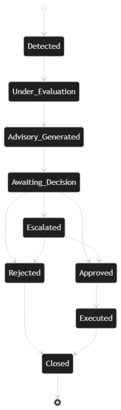
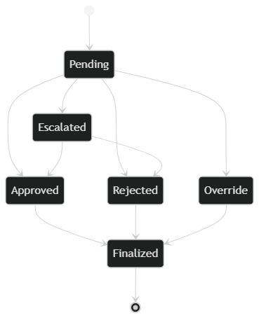
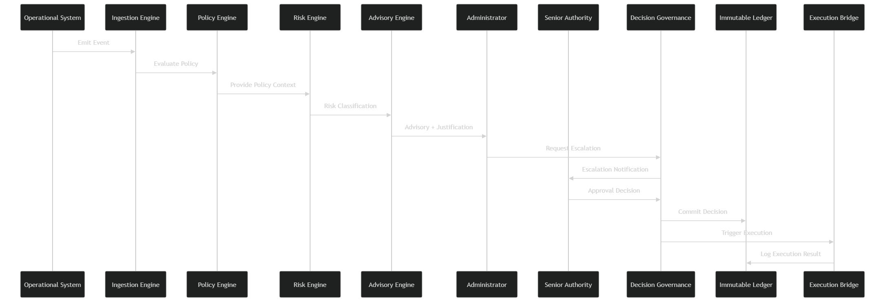

# Phase 3: Authority & Behavioral Modeling

## SentinelOps Governance Core

---

## Objective

Define:

- **Who can decide**
- **When a decision is required**
- **What transitions are irreversible**
- **Where authority gates exist**
- **How failure is handled**
- **How escalation works**

**We are modeling behavior before internal components.**

---

## 1. Core Authority Principle

**SentinelOps never executes independently.**

**Authority belongs to a human role.**

**The system evaluates.**
**The human decides.**
**The system records.**

### Authority Characteristics

Authority must always be:

- **Explicit**
- **Attributed**
- **Role validated**
- **Time bound**
- **Traceable**

---

## 2. Decision Flow Model

### End to End Behavioral Flow

```
Signal detected
↓
Compliance evaluation triggered
↓
Risk classification computed
↓
Advisory generated with justification
↓
Authority gate activated
↓
Administrator decision recorded
↓
Execution requested
↓
Execution result logged
↓
Decision lifecycle sealed in ledger
```

**No step may skip the authority gate.**

---

## 3. Authority Gates

### Authority Gate A: Before Execution

**Execution is impossible unless:**

- **Advisory exists**
- **Decision recorded**
- **Role validated**
- **Decision state marked approved**

### Authority Gate B: Before Escalation

**If risk exceeds threshold:**

- **Additional authority required**
- **Multi role confirmation required**

### Authority Gate C: Before Policy Override

**If advisory contradicts requested action:**

- **Override must be explicit**
- **Justification required**
- **Logged separately**

---

## 4. Irreversible States

**The following states are irreversible:**

- **Decision recorded**
- **Ledger entry committed**
- **Execution result logged**

**Once written to ledger, no mutation allowed.**

**Correction is additive only.**
**Never destructive.**

---

## 5. State Lifecycle Model

### Event States

```
Detected → Under Evaluation → Advisory Generated → Awaiting Decision → Approved/Rejected/Escalated → Executed → Closed
```

### Decision States

```
Pending → Approved/Rejected/Override/Escalated → Finalized
```

### Ledger State

```
Draft → Committed → Sealed
```

### State Transition Matrix

| Current State | Valid Transitions | Authority Required | Reversible |
|---------------|-------------------|-------------------|------------|
| **Detected** | Under Evaluation | System | Yes |
| **Under Evaluation** | Advisory Generated | System | Yes |
| **Advisory Generated** | Awaiting Decision | System | Yes |
| **Awaiting Decision** | Approved | Human | No |
| **Awaiting Decision** | Rejected | Human | No |
| **Awaiting Decision** | Escalated | Human | No |
| **Approved** | Executed | System | No |
| **Executed** | Closed | System | No |
| **Rejected** | Closed | System | No |
| **Escalated** | Approved/Escalated | Higher Authority | No |

---

## 6. Escalation Model

### Trigger Conditions

- **High risk classification**
- **Policy conflict**
- **Cross regulatory impact**
- **Manual override request**

### Escalation Path

```
Administrator → Senior Authority → Compliance Officer
```

### Escalation Recording

**Each escalation is recorded as:**

- **New decision entry**
- **Linked to original advisory**
- **Chain preserved**

### Escalation Authority Matrix

| Risk Level | Required Authority | Confirmation Type | Documentation |
|------------|-------------------|-------------------|----------------|
| **Low** | Administrator | Single | Standard decision |
| **Medium** | Administrator + Senior | Dual | Joint justification |
| **High** | Compliance Officer | Formal | Compliance review |
| **Critical** | Multiple roles | Consensus | Full governance review |

---

## 7. Failure Path Modeling

### Case A: Policy Engine Unavailable

#### Behavior

- **System halts advisory generation**
- **Marks event as compliance unknown**
- **Prevents execution**
- **Logs degraded mode**

#### Failure Response

```json
{
  "eventType": "policy_engine_failure",
  "timestamp": "iso8601",
  "eventId": "uuid",
  "status": "degraded_mode",
  "action": "execution_blocked",
  "reason": "compliance_evaluation_unavailable"
}
```

### Case B: Ledger Unavailable

#### Behavior

- **System halts decision recording**
- **Prevents execution**
- **Enters safe state**

#### Failure Response

```json
{
  "eventType": "ledger_failure",
  "timestamp": "iso8601",
  "status": "safe_state",
  "action": "all_operations_suspended",
  "reason": "audit_recording_unavailable"
}
```

### Case C: Risk Engine Failure

#### Behavior

- **Advisory generated with risk unknown flag**
- **Escalation enforced**
- **Execution blocked unless override**

#### Failure Response

```json
{
  "eventType": "risk_engine_failure",
  "timestamp": "iso8601",
  "eventId": "uuid",
  "status": "risk_unknown",
  "action": "escalation_required",
  "reason": "risk_assessment_unavailable"
}
```

### Failure Mode Summary

**SentinelOps always fails safe.**

---

## 8. Authority Invariants

**The following must always be true:**

- **No execution without recorded decision**
- **No decision without advisory reference**
- **No advisory without policy evaluation**
- **No ledger mutation**
- **No UI triggered execution bypass**
- **No hidden escalation**

**These are architectural truths, not implementation details.**

---

## 9. Governance Behavior Visualization


**This illustrates controlled state transitions and authority checkpoints.**

---

## 10. Decision Authority Framework

### Role-Based Authority Matrix

| Role | Decision Scope | Risk Threshold | Escalation Capability |
|------|----------------|----------------|----------------------|
| **Administrator** | Standard operations | Low-Medium | To Senior Authority |
| **Senior Authority** | High-impact operations | Medium-High | To Compliance Officer |
| **Compliance Officer** | Policy exceptions | High-Critical | To Governance Board |
| **Governance Board** | Strategic decisions | Critical | Final authority |

### Authority Validation Process

```
1. Role Authentication
   ↓
2. Permission Verification
   ↓
3. Risk Level Assessment
   ↓
4. Authority Sufficiency Check
   ↓
5. Decision Recording
   ↓
6. Execution Authorization
```

---

## 11. Behavioral Contracts

### Decision Contract

```json
{
  "decisionId": "uuid",
  "eventId": "uuid",
  "advisoryId": "uuid",
  "authority": {
    "role": "role_name",
    "userId": "user_identifier",
    "permissions": ["decision_scope"],
    "timestamp": "iso8601"
  },
  "decision": {
    "action": "approved|rejected|escalated",
    "justification": "human_reasoning",
    "riskAcceptance": "acknowledgment",
    "overrideReason": "explanation_if_applicable"
  },
  "validation": {
    "roleValid": true,
    "riskThreshold": "within_limits",
    "policyCompliance": "compliant|exception",
    "escalationRequired": false
  }
}
```

### Execution Authorization Contract

```json
{
  "executionId": "uuid",
  "decisionId": "uuid",
  "authorization": {
    "granted": true,
    "timestamp": "iso8601",
    "expiresAt": "iso8601",
    "scope": "authorized_actions"
  },
  "constraints": {
    "timeLimit": "duration",
    "actionScope": "permitted_operations",
    "systemTargets": ["authorized_systems"]
  },
  "audit": {
    "traceId": "uuid",
    "previousHash": "ledger_hash",
    "sequenceNumber": "integer"
  }
}
```

---

## 12. Behavioral Validation Criteria

The authority model is valid if:

- **Every execution path requires human decision**
- **All authority gates are enforced architecturally**
- **Irreversible states are protected**
- **Escalation paths are explicit and recorded**
- **Failure modes default to safe states**
- **No silent authority bypass exists**
- **All decisions are attributed and time-bound**

---

## 13. Governance Guarantees

### Structural Guarantees

- **Human authority cannot be bypassed**
- **Decisions cannot be executed without recording**
- **Ledger entries cannot be modified**
- **Escalation cannot be hidden**
- **Risk thresholds cannot be ignored**

### Behavioral Guarantees

- **System always fails safe**
- **Authority is always validated**
- **Decisions are always traceable**
- **Escalations are always documented**
- **Overrides are always justified**

---

## 14. Next Phase Preparation

This authority model establishes the foundation for:

- **Phase 4:** Component decomposition respecting authority boundaries
- **Phase 5-14:** Implementation that preserves behavioral invariants
- **Container design** that enforces authority gates
- **Data modeling** that supports decision traceability

---

## 16. Behavioral Modeling Diagrams

### 1. End to End Governance Flow

#### Activity Diagram


**This guarantees:**

- **No execution before ledger commit**
- **No advisory without policy evaluation**
- **No bypass of authority**

**Flow Sequence:**
1. Signal detection triggers compliance evaluation
2. Policy engine evaluates against regulatory frameworks
3. Risk scoring engine classifies severity
4. Advisory engine generates recommendation
5. Authority gate validates human decision
6. Decision governance records explicit choice
7. Ledger commits decision immutably
8. Execution bridge authorizes action
9. Execution result logged and sealed

### 2. Event Lifecycle

#### State Machine



**Irreversibility Rules:**

- **Once Approved or Rejected, cannot return to Awaiting_Decision**
- **Once Executed, cannot revert**

**State Transitions:**
- **Detected** → Under Evaluation (system initiated)
- **Under Evaluation** → Advisory Generated (policy complete)
- **Advisory Generated** → Awaiting Decision (human required)
- **Awaiting Decision** → Approved/Rejected/Escalated (authority exercised)
- **Approved** → Executed (system authorized)
- **Executed** → Closed (lifecycle complete)

### 3. Decision Lifecycle

#### State Machine



**Constraints:**

- **Override requires justification**
- **Finalized decisions are immutable**
- **No state regression allowed**

**Decision States:**
- **Pending** - Initial state awaiting human input
- **Approved** - Positive decision with authority
- **Rejected** - Negative decision with reasoning
- **Override** - Exception to advisory with justification
- **Escalated** - Elevated to higher authority
- **Finalized** - Committed to ledger, immutable

### 4. Escalation Sequence

#### Sequence Diagram



**This proves:**

- **Escalation is explicit**
- **Authority is layered**
- **Ledger write happens before execution**

**Escalation Flow:**
1. Original decision triggers escalation condition
2. System notifies higher authority role
3. Higher authority reviews original advisory
4. Escalation decision recorded with justification
5. Ledger updated with escalation chain
6. Execution authorized based on escalated decision
7. All steps recorded with full traceability

---

## 17. Diagram Validation Criteria

The behavioral diagrams are valid if they demonstrate:

- **Authority enforcement at every execution point**
- **Irreversible state transitions**
- **Complete audit trail generation**
- **Explicit escalation pathways**
- **No bypass mechanisms**
- **Human decision preservation**

---

## 18. Authority Model Summary

**SentinelOps behavioral modeling establishes governance through structural authority enforcement, ensuring that human decision rights are preserved, all actions are traceable, and the system cannot operate outside defined authority boundaries.**

---

*This Phase 3 behavioral modeling defines the governance core of SentinelOps, establishing authority principles, decision flows, and failure modes that will be enforced through all subsequent architectural layers.*
