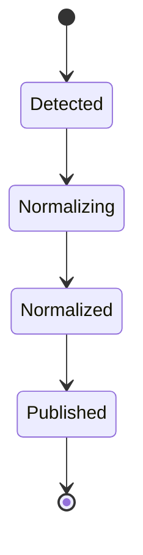
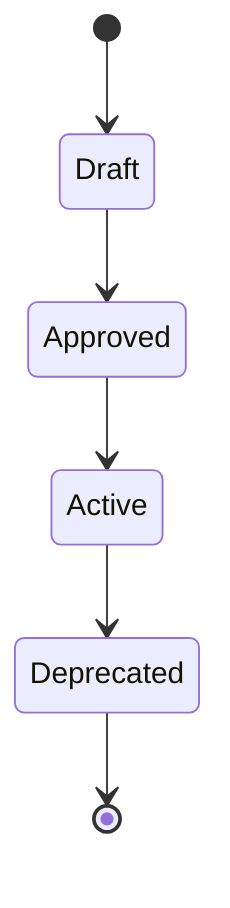
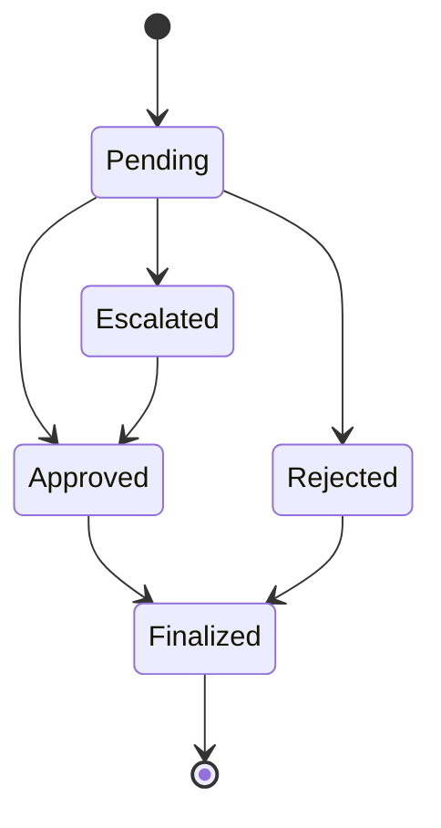
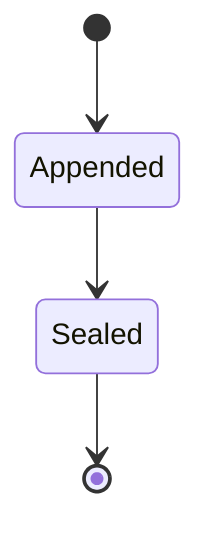
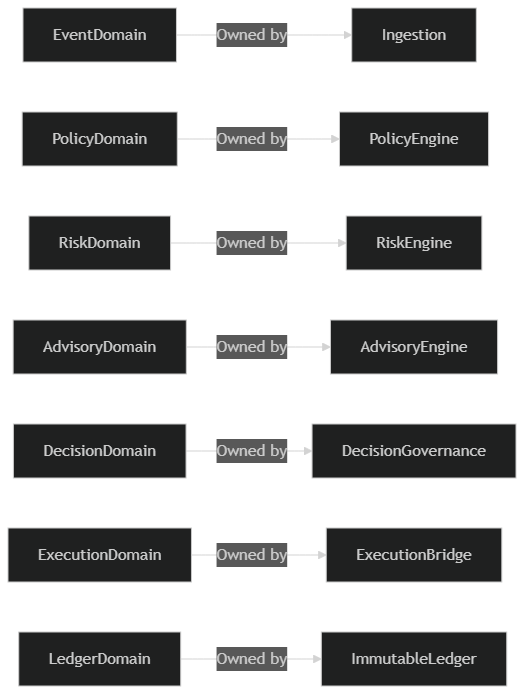
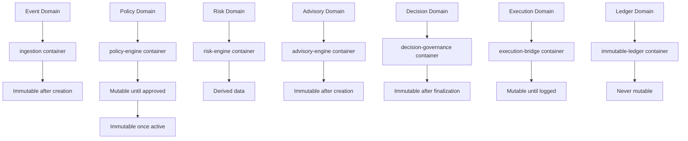
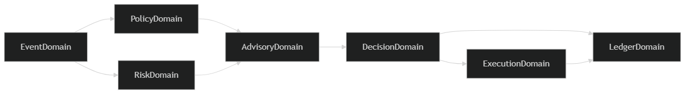
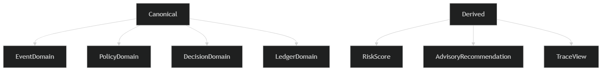

# Phase 6: Data Domain Identification

## SentinelOps Governance Backbone

---

## Objective

**Identify:**

- **What kinds of data exist**
- **Who owns each type**
- **What is canonical**
- **What is derived**
- **What may cross boundaries**
- **What must never cross boundaries**

**This is not schema.**
**This is semantic authority mapping.**

---

## Core Architectural Principle

**Each domain has:**

- **A single authoritative owner container**
- **Clear lifecycle**
- **Immutable or mutable classification**
- **Explicit boundary rules**

**No domain is shared in ownership.**

---

## Domain 1 — Event Domain

### Owned by: ingestion

### Represents:

- **Raw signals from operational systems**
- **Normalized canonical event form**

### Canonical Data:

- **EventID**
- **SourceSystem**
- **EventType**
- **Timestamp**
- **Payload**
- **CorrelationID**

### Lifecycle:

```
Detected → Normalized → Published
```

### Mutability:

**Immutable after normalization**

### Boundary Rule:

**Event domain cannot be modified outside ingestion.**
**All other containers consume read only form.**

---

## Domain 2 — Policy Domain

### Owned by: policy-engine

### Represents:

- **Internal compliance policies**
- **Regulatory mappings**
- **Policy versions**
- **Conflict rules**

### Canonical Data:

- **PolicyID**
- **PolicyVersion**
- **PolicyConditions**
- **RegulatoryReference**
- **PriorityLevel**

### Lifecycle:

```
Draft → Approved → Active → Deprecated
```

### Mutability:

**Mutable until activated**
**Immutable once versioned and active**

### Boundary Rule:

**No container except policy-engine may modify policy definitions.**

---

## Domain 3 — Risk Domain

### Owned by: risk-engine

### Represents:

- **Risk model definitions**
- **Scoring thresholds**
- **Risk classification outputs**

### Canonical Data:

- **RiskModelID**
- **RiskScore**
- **RiskLevel**
- **ThresholdVersion**

### Lifecycle:

```
ModelDefined → Active → Updated
```

### RiskScoreOutput:

**Ephemeral per event**
**Stored only as part of Advisory or Decision**

### Boundary Rule:

**Risk engine owns scoring logic.**
**Other containers cannot compute risk independently.**

---

## Domain 4 — Advisory Domain

### Owned by: advisory-engine

### Represents:

- **Compliance evaluated recommendation**
- **Human readable justification**
- **Suggested actions**

### Canonical Data:

- **AdvisoryID**
- **RelatedEventID**
- **PolicyReferences**
- **RiskLevel**
- **RecommendationOptions**
- **JustificationText**
- **AdvisoryVersion**

### Lifecycle:

```
Generated → Presented → ReferencedByDecision
```

### Mutability:

**Immutable once generated**

### Boundary Rule:

**No container may alter advisory content after issuance.**

---

## Domain 5 — Decision Domain

### Owned by: decision-governance

### Represents:

- **Explicit human decision**
- **Role attribution**
- **Escalation chain**
- **Override justification**

### Canonical Data:

- **DecisionID**
- **AdvisoryID**
- **DecisionType**
- **DecisionMakerRole**
- **Timestamp**
- **OverrideReason**
- **EscalationPath**

### Lifecycle:

```
Pending → Approved/Rejected/Escalated → Finalized
```

### Mutability:

**Immutable once finalized**

### Boundary Rule:

**Only decision-governance may create decisions.**
**No advisory modification allowed.**

---

## Domain 6 — Execution Domain

### Owned by: execution-bridge

### Represents:

- **Approved action execution**
- **Target system acknowledgment**

### Canonical Data:

- **ExecutionID**
- **DecisionID**
- **TargetSystem**
- **ExecutionStatus**
- **ExecutionTimestamp**

### Lifecycle:

```
Requested → Dispatched → Acknowledged → Logged
```

### Mutability:

**Status may transition until acknowledgment**
**Immutable once logged to ledger**

### Boundary Rule:

**Execution cannot exist without DecisionID reference.**

---

## Domain 7 — Ledger Domain

### Owned by: immutable-ledger

### Represents:

- **Full decision chain history**
- **Hash chain integrity**
- **Trace index**

### Canonical Data:

- **LedgerEntryID**
- **PreviousHash**
- **CurrentHash**
- **EntryType**
- **LinkedEntityID**
- **Timestamp**

### Lifecycle:

```
Appended → Sealed
```

### Mutability:

**Never mutable**

### Boundary Rule:

**Append only.**
**No update.**
**No delete.**

---

## Cross Domain Interaction Rules

### Event flows into:

```
Policy and Risk engines
```

### Policy and Risk produce:

```
Advisory
```

### Advisory triggers:

```
Decision
```

### Decision triggers:

```
Ledger write and Execution
```

### Execution produces:

```
Ledger entry
```

### Ledger never flows back to mutate upstream domains.

---

## Canonical vs Derived Classification

### Canonical Data (Immutable Source of Truth)

- **Event**
- **Policy**
- **Decision**
- **LedgerEntry**

### Derived Data (Calculated/Transient)

- **RiskScore**
- **AdvisoryRecommendation**
- **TraceView**

### Derived Data Rules

- **Derived data can be recalculated.**
- **Canonical data cannot be altered.**

---

## Governance Invariant Reinforcement

### From domain mapping we now guarantee:

- **No shared mutable data**
- **No cross domain write authority**
- **No ambiguous ownership**
- **No hidden policy mutation**
- **No silent decision injection**

---

## Domain Ownership Registry

| Domain | Owner Container | Canonical Data Type | Mutability | Access Pattern |
|---------|----------------|-------------------|------------|--------------|
| **Event** | ingestion | Normalized Event | Immutable after creation | Read-only to others |
| **Policy** | policy-engine | Policy Definition | Mutable until approved | Write-only to owner |
| **Risk** | risk-engine | Risk Model | Mutable | Write-only to owner |
| **Advisory** | advisory-engine | Advisory Object | Immutable after creation | Read-only to others |
| **Decision** | decision-governance | Decision Record | Immutable after finalization | Write-only to owner |
| **Execution** | execution-bridge | Execution Record | Mutable until logged | Write-only to owner |
| **Ledger** | immutable-ledger | Ledger Entry | Never mutable | Append-only to owner |

---

## Domain Boundary Enforcement Matrix

| Source Domain | Target Domain | Allowed Operations | Authority Required |
|--------------|----------------|-------------------|-------------------|
| **Event** | Policy | Read | No |
| **Event** | Risk | Read | No |
| **Policy** | Advisory | Read | No |
| **Risk** | Advisory | Read | No |
| **Advisory** | Decision | Read | No |
| **Decision** | Ledger | Write | Yes |
| **Decision** | Execution | Read | Yes |
| **Execution** | Ledger | Write | Yes |
| **Ledger** | Any | Read | No |

---

## Data Flow Architecture

```
┌─────────────────────────────────────────────────────────────────────────────────┐
│                    SENTINELOPS DATA FLOW ARCHITECTURE                    │
└─────────────────────────────────────────────────────────────────────────────────┘

┌─────────────┐    ┌─────────────┐    ┌─────────────┐    ┌─────────────┐
│   Event     │    │   Policy     │    │   Risk       │    │   Advisory    │
│   Domain     │    │   Domain     │    │   Domain     │    │   Domain     │
│             │    │             │    │             │    │             │
│ Immutable    │    │ Mutable      │    │ Derived      │    │ Immutable    │
│ Data         │    │ Data         │    │ Data         │    │ Data         │
└─────┬───────┘    └─────┬───────┘    └─────┬───────┘    └─────┬───────┘
      │                    │                    │                    │
      ▼                    ▼                    ▼
┌─────────────┐    ┌─────────────┐    ┌─────────────┐    ┌─────────────┐
│   Decision   │    │   Execution   │    │   Ledger      │
│   Domain     │    │   Domain     │    │   Domain     │
│             │    │             │    │             │    │             │
│ Immutable    │    │ Mutable      │    │ Never        │
│ Data         │    │ Data         │    │ Mutable      │
└─────┬───────┘    └─────┬───────┘    └─────┬───────┘
      │                    │                    │
      ▼                    ▼                    ▼
                    ┌─────────────────────────────────────────┐
                    │     ADMINISTRATIVE INTERFACE          │
                    │     (Decision Surface)              │
                    └─────────────────────────────────────────┘
```

---

## Domain Lifecycle Management

### Event Domain Lifecycle



### Policy Domain Lifecycle



### Decision Domain Lifecycle



### Ledger Domain Lifecycle



---

## Data Domain Visualization

### 1. Domain Ownership Map



**This shows:**
- **Domain → Owning Container → Mutability → Lifecycle Authority**

**Example Mermaid Diagram:**



**This eliminates ambiguity.**

### 2. Domain to Container Boundary Diagram


**This reinforces that no domain is co-owned.**

**Key Boundaries Shown:**
- Clear separation lines between domains
- Single container ownership per domain
- No overlapping ownership areas
- Explicit boundary enforcement points

### 3. Cross Domain Flow Map



**This clarifies what moves across boundaries.**

**Important detail:**
- **Arrows represent data consumption, not ownership transfer**
- **Directional flow follows architectural rules**
- **No circular dependencies shown**

### 4. Canonical vs Derived Classification



**This helps auditors understand what can be recalculated versus what must never change.**

**Classification Rules:**
- **Canonical (Green):** Immutable source of truth
- **Derived (Blue):** Calculated/transient data
- **Protected (Red):** Never mutable data

---

## Data Domain Validation Criteria

The domain identification is valid if:

- **Each domain has exactly one owner container**
- **Canonical data types are clearly defined**
- **Mutability rules are explicit and enforced**
- **Cross-domain boundaries are architecturally controlled**
- **Derived vs canonical data is properly classified**
- **No shared ownership exists**
- **Governance invariants are reinforced**

---

## Next Phase Preparation

This domain identification establishes the foundation for:

- **Phase 7:** Logical data modeling respecting domain boundaries
- **Phase 8:** Database schema design aligned with domain ownership
- **Phase 9-14:** Implementation that cannot violate domain authority
- **Data governance** that protects canonical data integrity

---

## Data Domain Summary

**This Phase 6 data domain identification establishes semantic authority mapping through clear ownership boundaries, ensuring that each data type has a single authoritative owner and well-defined lifecycle, preventing ambiguous data governance and cross-domain authority violations.**

---

*This Phase 6 domain identification defines the semantic data architecture of SentinelOps, establishing ownership, mutability, and boundary rules that will be enforced through all subsequent data modeling and implementation phases.*
