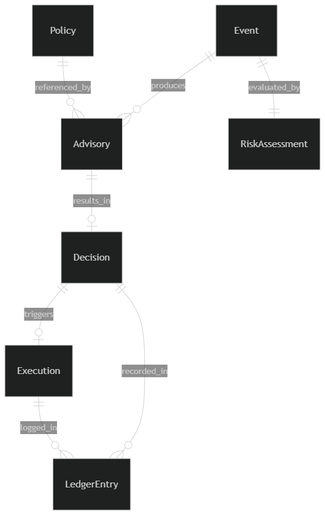
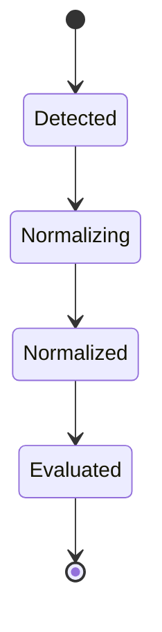
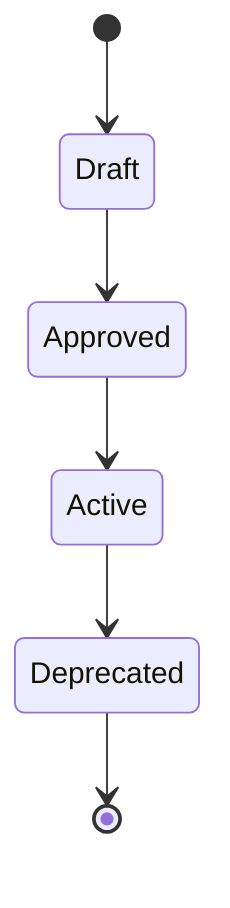
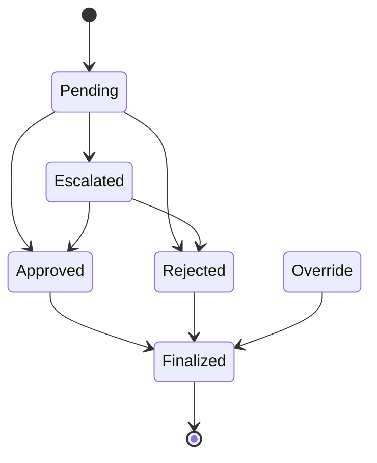
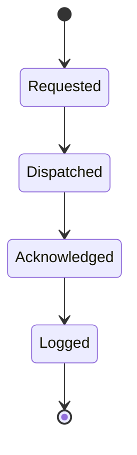
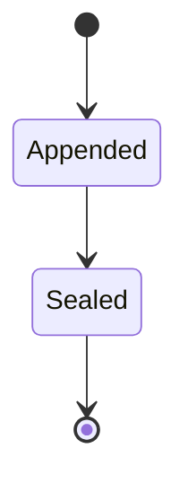

# Phase 7: Logical Data Modeling

## SentinelOps Governance Backbone

---

## Objective

**Define:**

- **Entities per domain**
- **Business attributes**
- **Relationships between entities**
- **State transitions**
- **Invariants per entity**

**Technology neutral.**
**No SQL.**
**No storage assumptions.**

---

## 1. Event Domain Model

### Entity: Event

**Represents normalized operational signal.**

#### Attributes:

- **EventID**
- **SourceSystem**
- **EventType**
- **OccurredAt**
- **ReceivedAt**
- **PayloadReference**
- **CorrelationID**
- **IntegritySignature**

#### State:

```
Detected → Normalized → Evaluated
```

#### Invariants:

- **EventID must be globally unique**
- **Event cannot be modified after Normalized**
- **IntegritySignature must validate**

#### Relationship:

```
Event 1 → 0..* Advisory
```

**An event may produce multiple advisories if re-evaluated under policy updates.**

---

## 2. Policy Domain Model

### Entity: Policy

#### Attributes:

- **PolicyID**
- **Version**
- **Description**
- **Conditions**
- **RegulatoryReference**
- **PriorityLevel**
- **Status**

#### State:

```
Draft → Approved → Active → Deprecated
```

#### Invariants:

- **Only one Active version per PolicyID**
- **Active policies cannot be modified**
- **Deprecated policies remain historically accessible**

#### Relationship:

```
Policy 1 → 0..* Advisory
```

**Advisory references to policy version used at evaluation time.**

---

## 3. Risk Domain Model

### Entity: RiskModel

#### Attributes:

- **RiskModelID**
- **Version**
- **ThresholdDefinition**
- **ClassificationRules**
- **Status**

#### State:

```
Defined → Active → Superseded
```

#### Invariants:

- **Only one active RiskModel per domain**
- **RiskModel versions are immutable once active**

### Entity: RiskAssessment

#### Attributes:

- **RiskAssessmentID**
- **EventID**
- **RiskModelVersion**
- **RiskScore**
- **RiskLevel**
- **EvaluatedAt**

#### Invariants:

- **RiskAssessment tied to specific EventID**
- **Cannot exist without Event**
- **Immutable after creation**

#### Relationship:

```
Event 1 → 1 RiskAssessment
```

---

## 4. Advisory Domain Model

### Entity: Advisory

#### Attributes:

- **AdvisoryID**
- **EventID**
- **PolicyVersion**
- **RiskLevel**
- **RecommendationOptions**
- **JustificationText**
- **CreatedAt**
- **AdvisoryVersion**

#### State:

```
Generated → Presented → Referenced
```

#### Invariants:

- **Advisory cannot exist without Event and PolicyVersion**
- **Advisory content immutable after Generated**
- **AdvisoryVersion must increment if regenerated**

#### Relationship:

```
Advisory 1 → 0..1 Decision
```

---

## 5. Decision Domain Model

### Entity: Decision

#### Attributes:

- **DecisionID**
- **AdvisoryID**
- **DecisionType** (Approve, Reject, Override, Escalate)
- **DecisionMakerID**
- **DecisionMakerRole**
- **Justification**
- **CreatedAt**
- **FinalizedAt**

#### State:

```
Pending → Approved
Pending → Rejected
Pending → Escalated
Escalated → Approved
Escalated → Rejected
Override → Finalized
```

#### Invariants:

- **Decision cannot exist without Advisory**
- **Override requires Justification**
- **Finalized decision immutable**
- **Only one Finalized decision per Advisory**

---

## 6. Execution Domain Model

### Entity: Execution

#### Attributes:

- **ExecutionID**
- **DecisionID**
- **TargetSystem**
- **ExecutionCommand**
- **ExecutionStatus**
- **RequestedAt**
- **CompletedAt**

#### State:

```
Requested → Dispatched → Acknowledged → Logged
```

#### Invariants:

- **Execution cannot exist without Approved Decision**
- **ExecutionStatus immutable once Logged**

---

## 7. Ledger Domain Model

### Entity: LedgerEntry

#### Attributes:

- **LedgerEntryID**
- **EntryType**
- **LinkedEntityID**
- **PreviousHash**
- **CurrentHash**
- **Timestamp**

#### State:

```
Appended → Sealed
```

#### Invariants:

- **PreviousHash must match prior entry**
- **No update allowed**
- **No delete allowed**
- **LedgerEntry immutable**

#### Relationship:

**LedgerEntry references:**

- **Event**
- **Advisory**
- **Decision**
- **Execution**

**But does not own them.**

---

## Cross Domain Relationship Overview

### Entity Relationship Diagram



**This diagram shows logical relationships only.**

**No schema implied.**

---

## Global System Invariants

### Non-Negotiable Governance Truths

- **No Decision without Advisory**
- **No Advisory without Event and Policy**
- **No Execution without Approved Decision**
- **No LedgerEntry without hash chain integrity**
- **No mutable state after Finalized or Sealed**

### Enforcement Mechanisms

#### At Entity Level
- **Primary key constraints**
- **Required attribute validation**
- **State transition rules**
- **Relationship cardinality enforcement**

#### At Domain Level
- **Cross-domain reference integrity**
- **Authority boundary enforcement**
- **Lifecycle state management**

#### At System Level
- **Immutable data protection**
- **Audit trail completeness**
- **Decision authority preservation**

---

## Entity Lifecycle Management

### Event Lifecycle



### Policy Lifecycle



### Decision Lifecycle



### Execution Lifecycle



### Ledger Lifecycle



---

## Data Model Validation Criteria

The logical data model is valid if:

- **Each entity has clearly defined attributes**
- **State transitions are explicitly modeled**
- **Invariants are enforced at entity level**
- **Cross-domain relationships are architecturally sound**
- **No storage technology assumptions**
- **Global system invariants are preserved**

---

## Technology Neutrality Principles

### No SQL Assumptions

- **Relational model** expressed in entity-relationship terms
- **No normalization forms** implied
- **No transaction patterns** assumed
- **No query optimization** considered

### No Storage Assumptions

- **In-memory persistence** possible
- **Document database** possible
- **Graph database** possible
- **Event sourcing** possible

### Implementation Flexibility

- **Entity interfaces** support multiple storage backends
- **Relationship mappings** support various ORMs
- **State management** supports different persistence strategies

---

## Data Model Evolution Strategy

### Versioning Approach

- **Entity versioning** for structural changes
- **Attribute evolution** for business requirement changes
- **Relationship adaptation** for new domain interactions
- **Invariant preservation** through all evolution

### Migration Considerations

- **Data transformation** scripts for entity changes
- **State transition** preservation during migration
- **Relationship integrity** maintenance
- **Backward compatibility** for existing integrations

---

## Next Phase Preparation

This logical data model establishes the foundation for:

- **Phase 8:** Database schema design aligned with entity relationships
- **Phase 9:** Invariants and non-negotiable constraints enforcement
- **Phase 10-14:** Implementation respecting entity boundaries and invariants

---

## Logical Data Model Summary

**This Phase 7 logical data modeling establishes technology-neutral entity definitions, clear state transitions, and enforceable invariants, ensuring that SentinelOps data architecture is semantically sound and implementation-agnostic.**

---

*This Phase 7 logical data modeling defines the semantic structure of SentinelOps data, establishing entities, attributes, relationships, and invariants that will be enforced through all subsequent implementation phases.*
