# Phase 8: Logical Database Schema Design

## SentinelOps Governance Backbone

---

## Objective

**Translate logical models into persistable, ownership-safe structures.**

**Phase 7 defined meaning.**
**Phase 8 defines persistence.**

---

## Schema Design Principles

### Domain Isolation
- **Each domain has isolated storage**
- **No shared tables across domains**
- **Clear ownership boundaries**
- **Referential integrity enforcement**

### Immutable Ledger Design
- **Append-only operations**
- **Hash chain integrity**
- **No update/delete capabilities**

### Referential Strategy
- **Foreign keys for relationships**
- **No circular dependencies**
- **Controlled data access patterns**

### Technology Neutrality
- **Relational model** (not SQL-specific)
- **Implementation-agnostic** design
- **Storage-technology independent** structure

---

## 1. Logical Schema Diagram


**ER-style diagram showing:**
- **Tables or collections**
- **Primary identifiers**
- **Foreign references**
- **Cardinality**

### Example Structure in Mermaid

```mermaid
erDiagram
    EVENT {
        string EventID PK
        string SourceSystem
        string EventType
        datetime OccurredAt
        string CorrelationID
    }
    
    POLICY {
        string PolicyID PK
        int Version PK
        string Status
        text Description
    }
    
    RISK_MODEL {
        string RiskModelID PK
        int Version PK
        string Status
    }
    
    RISK_ASSESSMENT {
        string RiskAssessmentID PK
        string EventID FK
        float RiskScore
        string RiskLevel
    }
    
    ADVISORY {
        string AdvisoryID PK
        string EventID FK
        string PolicyID FK
        int PolicyVersion
    }
    
    DECISION {
        string DecisionID PK
        string AdvisoryID FK
        string DecisionType
        string DecisionMakerRole
    }
    
    EXECUTION {
        string ExecutionID PK
        string DecisionID FK
        string TargetSystem
    }
    
    LEDGER_ENTRY {
        string LedgerEntryID PK
        string LinkedEntityID FK
        string PreviousHash
        string CurrentHash
        datetime Timestamp
    }
```



**This shows how entities become persistable structures.**

---

## 2. Domain Isolated Storage Map

### Storage Separation Strategy


**This reinforces domain ownership at database level.**

### Storage Layout

```
┌─────────────────────────────────────────────────────────────────────────┐
│                    SENTINELOPS DATABASE STORAGE ARCHITECTURE            │
└─────────────────────────────────────────────────────────────────────────┘

┌─────────────┐    ┌─────────────┐    ┌─────────────┐    ┌─────────────┐
│   EVENT      │    │   POLICY     │    │   RISK       │    │   ADVISORY    │
│   DOMAIN     │    │   DOMAIN     │    │   DOMAIN     │    │   DOMAIN     │
│   STORAGE    │    │   STORAGE     │    │   STORAGE     │    │   STORAGE     │
└─────┬───────┘    └─────┬───────┘    └─────┬───────┘    └─────┬───────┘
      │                    │                    │                    │
      ▼                    ▼                    ▼                    ▼
┌─────────────┐    ┌─────────────┐    ┌─────────────┐    ┌─────────────┐
│   DECISION   │    │   EXECUTION   │    │   LEDGER      │
│   DOMAIN     │    │   DOMAIN     │    │   DOMAIN     │
│   STORAGE    │    │   STORAGE     │    │   STORAGE     │
└─────┬───────┘    └─────┬───────┘    └─────┬───────┘
      │                    │                    │
      ▼                    ▼                    ▼
                    ┌─────────────────────────────────────────┐
                    │     ADMINISTRATIVE INTERFACE          │
                    │     (Query Layer)                   │
                    └─────────────────────────────────────────┘
```

**This proves no shared table ownership.**

---

## 3. Reference Flow Diagram

### Controlled Data Access Patterns


**This shows references without implying join level coupling.**

### Flow Characteristics

- **References are directional**
- **Ownership is not transferred**
- **Data access follows domain boundaries**
- **No circular dependencies**

---

## 4. Table Definitions

### EVENT Domain Tables

#### EVENT Table

```sql
CREATE TABLE event (
    event_id VARCHAR(36) PRIMARY KEY,
    source_system VARCHAR(100) NOT NULL,
    event_type VARCHAR(50) NOT NULL,
    occurred_at TIMESTAMP NOT NULL,
    received_at TIMESTAMP NOT NULL,
    payload_reference VARCHAR(255),
    correlation_id VARCHAR(36),
    integrity_signature VARCHAR(512),
    created_at TIMESTAMP DEFAULT CURRENT_TIMESTAMP,
    INDEX idx_event_source (source_system),
    INDEX idx_event_type (event_type),
    INDEX idx_event_occurred (occurred_at)
);
```

#### EVENT_PAYLOAD Table (Optional)

```sql
CREATE TABLE event_payload (
    event_id VARCHAR(36) PRIMARY KEY,
    payload_data JSON,
    created_at TIMESTAMP DEFAULT CURRENT_TIMESTAMP,
    FOREIGN KEY (event_id) REFERENCES event(event_id)
);
```

### POLICY Domain Tables

#### POLICY Table

```sql
CREATE TABLE policy (
    policy_id VARCHAR(36) PRIMARY KEY,
    version INTEGER NOT NULL,
    status VARCHAR(20) NOT NULL,
    description TEXT,
    regulatory_reference VARCHAR(100),
    priority_level INTEGER NOT NULL,
    created_at TIMESTAMP DEFAULT CURRENT_TIMESTAMP,
    updated_at TIMESTAMP DEFAULT CURRENT_TIMESTAMP,
    UNIQUE KEY uk_policy_version (policy_id, version),
    INDEX idx_policy_status (status),
    INDEX idx_policy_priority (priority_level)
);
```

#### POLICY_CONDITION Table

```sql
CREATE TABLE policy_condition (
    condition_id VARCHAR(36) PRIMARY KEY,
    policy_id VARCHAR(36) NOT NULL,
    condition_type VARCHAR(50) NOT NULL,
    condition_expression TEXT NOT NULL,
    created_at TIMESTAMP DEFAULT CURRENT_TIMESTAMP,
    FOREIGN KEY (policy_id) REFERENCES policy(policy_id),
    INDEX idx_policy_condition (policy_id)
);
```

### RISK Domain Tables

#### RISK_MODEL Table

```sql
CREATE TABLE risk_model (
    model_id VARCHAR(36) PRIMARY KEY,
    version INTEGER NOT NULL,
    threshold_definition JSON NOT NULL,
    classification_rules JSON NOT NULL,
    status VARCHAR(20) NOT NULL,
    created_at TIMESTAMP DEFAULT CURRENT_TIMESTAMP,
    updated_at TIMESTAMP DEFAULT CURRENT_TIMESTAMP,
    UNIQUE KEY uk_model_version (model_id, version),
    INDEX idx_risk_model_status (status)
);
```

#### RISK_ASSESSMENT Table

```sql
CREATE TABLE risk_assessment (
    assessment_id VARCHAR(36) PRIMARY KEY,
    event_id VARCHAR(36) NOT NULL,
    risk_model_id VARCHAR(36) NOT NULL,
    risk_model_version INTEGER NOT NULL,
    risk_score DECIMAL(10,4) NOT NULL,
    risk_level VARCHAR(20) NOT NULL,
    evaluated_at TIMESTAMP DEFAULT CURRENT_TIMESTAMP,
    FOREIGN KEY (event_id) REFERENCES event(event_id),
    FOREIGN KEY (risk_model_id) REFERENCES risk_model(risk_model_id),
    INDEX idx_risk_assessment_event (event_id),
    INDEX idx_risk_assessment_level (risk_level)
);
```

### ADVISORY Domain Tables

#### ADVISORY Table

```sql
CREATE TABLE advisory (
    advisory_id VARCHAR(36) PRIMARY KEY,
    event_id VARCHAR(36) NOT NULL,
    policy_id VARCHAR(36) NOT NULL,
    policy_version INTEGER NOT NULL,
    risk_level VARCHAR(20) NOT NULL,
    recommendation_options JSON,
    justification_text TEXT NOT NULL,
    created_at TIMESTAMP DEFAULT CURRENT_TIMESTAMP,
    advisory_version INTEGER DEFAULT 1,
    FOREIGN KEY (event_id) REFERENCES event(event_id),
    FOREIGN KEY (policy_id) REFERENCES policy(policy_id),
    INDEX idx_advisory_event (event_id),
    INDEX idx_advisory_policy (policy_id),
    INDEX idx_advisory_risk_level (risk_level)
);
```

### DECISION Domain Tables

#### DECISION Table

```sql
CREATE TABLE decision (
    decision_id VARCHAR(36) PRIMARY KEY,
    advisory_id VARCHAR(36) NOT NULL,
    decision_type VARCHAR(20) NOT NULL,
    decision_maker_id VARCHAR(36) NOT NULL,
    decision_maker_role VARCHAR(50) NOT NULL,
    justification TEXT,
    created_at TIMESTAMP DEFAULT CURRENT_TIMESTAMP,
    finalized_at TIMESTAMP,
    FOREIGN KEY (advisory_id) REFERENCES advisory(advisory_id),
    INDEX idx_decision_advisory (advisory_id),
    INDEX idx_decision_type (decision_type),
    INDEX idx_decision_maker (decision_maker_id),
    INDEX idx_decision_status (created_at, finalized_at)
);
```

### EXECUTION Domain Tables

#### EXECUTION Table

```sql
CREATE TABLE execution (
    execution_id VARCHAR(36) PRIMARY KEY,
    decision_id VARCHAR(36) NOT NULL,
    target_system VARCHAR(100) NOT NULL,
    execution_command JSON,
    execution_status VARCHAR(20) NOT NULL,
    requested_at TIMESTAMP DEFAULT CURRENT_TIMESTAMP,
    completed_at TIMESTAMP,
    FOREIGN KEY (decision_id) REFERENCES decision(decision_id),
    INDEX idx_execution_decision (decision_id),
    INDEX idx_execution_target (target_system),
    INDEX idx_execution_status (execution_status)
);
```

### LEDGER Domain Tables

#### LEDGER_ENTRY Table

```sql
CREATE TABLE ledger_entry (
    entry_id VARCHAR(36) PRIMARY KEY,
    entry_type VARCHAR(20) NOT NULL,
    linked_entity_id VARCHAR(36) NOT NULL,
    previous_hash VARCHAR(64),
    current_hash VARCHAR(64) NOT NULL,
    entry_data JSON,
    timestamp TIMESTAMP DEFAULT CURRENT_TIMESTAMP,
    sealed_at TIMESTAMP,
    INDEX idx_ledger_entry_type (entry_type),
    INDEX idx_ledger_linked_entity (linked_entity_id),
    INDEX idx_ledger_timestamp (timestamp),
    INDEX idx_ledger_hash (previous_hash, current_hash)
);
```

---

## 5. Referential Integrity Constraints

### Foreign Key Relationships

```sql
-- Event to Advisory
ALTER TABLE advisory ADD CONSTRAINT fk_advisory_event 
    FOREIGN KEY (event_id) REFERENCES event(event_id);

-- Advisory to Decision  
ALTER TABLE decision ADD CONSTRAINT fk_decision_advisory 
    FOREIGN KEY (advisory_id) REFERENCES advisory(advisory_id);

-- Decision to Execution
ALTER TABLE execution ADD CONSTRAINT fk_execution_decision 
    FOREIGN KEY (decision_id) REFERENCES decision(decision_id);

-- Decision to Ledger
ALTER TABLE ledger_entry ADD CONSTRAINT fk_ledger_decision 
    FOREIGN KEY (linked_entity_id) REFERENCES decision(decision_id);

-- Execution to Ledger
ALTER TABLE ledger_entry ADD CONSTRAINT fk_ledger_execution 
    FOREIGN KEY (linked_entity_id) REFERENCES execution(execution_id);

-- Event to Risk Assessment
ALTER TABLE risk_assessment ADD CONSTRAINT fk_risk_event 
    FOREIGN KEY (event_id) REFERENCES event(event_id);

-- Policy to Advisory
ALTER TABLE advisory ADD CONSTRAINT fk_advisory_policy 
    FOREIGN KEY (policy_id) REFERENCES policy(policy_id);

-- Risk Model to Risk Assessment
ALTER TABLE risk_assessment ADD CONSTRAINT fk_risk_model 
    FOREIGN KEY (risk_model_version) REFERENCES risk_model(version);
```

### Cascade Rules

```sql
-- Ledger entries are immutable - no cascade delete
ALTER TABLE ledger_entry ADD CONSTRAINT chk_ledger_immutable 
    CHECK (sealed_at IS NOT NULL OR sealed_at > created_at);

-- Decisions cannot be modified after finalization
ALTER TABLE decision ADD CONSTRAINT chk_decision_immutable 
    CHECK (finalized_at IS NOT NULL OR finalized_at > created_at);

-- Advisory cannot be modified after creation
ALTER TABLE advisory ADD CONSTRAINT chk_advisory_immutable 
    CHECK (advisory_version > 0 AND created_at = updated_at);
```

---

## Governance Constraints at Persistence Level

### Ledger Append Only

```sql
-- Ledger table only allows append operations
CREATE TRIGGER ledger_append_only
BEFORE INSERT ON ledger_entry
BEGIN
    IF NEW.entry_type NOT IN ('APPEND') THEN
        RAISE EXCEPTION 'Only append operations allowed on ledger';
    END IF;
END;
```

### Decision Finalization Lock

```sql
-- Prevent modification of finalized decisions
CREATE TRIGGER decision_immutable
BEFORE UPDATE ON decision
BEGIN
    IF OLD.finalized_at IS NOT NULL AND NEW.finalized_at IS NOT NULL THEN
        RAISE EXCEPTION 'Cannot modify finalized decision';
    END IF;
END;
```

---

## Schema Validation Criteria

The logical database schema is valid if:

- **Domain isolation is enforced through separate table structures**
- **Referential integrity is maintained through foreign keys**
- **Ledger immutability is enforced through constraints**
- **Performance is optimized through strategic indexing**
- **Migration strategy supports evolution**
- **Technology mapping supports multiple implementation options**

---

## Next Phase Preparation

This logical database schema establishes the foundation for:

- **Phase 9:** Invariants and non-negotiable constraints enforcement
- **Phase 10:** End-to-end traceability validation
- **Phase 11-14:** Implementation respecting schema boundaries

---

## Logical Database Schema Summary

**This Phase 8 logical database schema design translates entity relationships into persistable structures, ensuring domain isolation, referential integrity, and immutable ledger design while maintaining technology neutrality and implementation flexibility.**

---

*This Phase 8 logical database schema design creates the persistent foundation for SentinelOps, establishing ownership-safe storage structures that enforce governance boundaries through database constraints and indexing strategies.*
