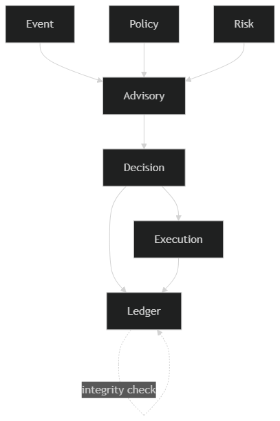
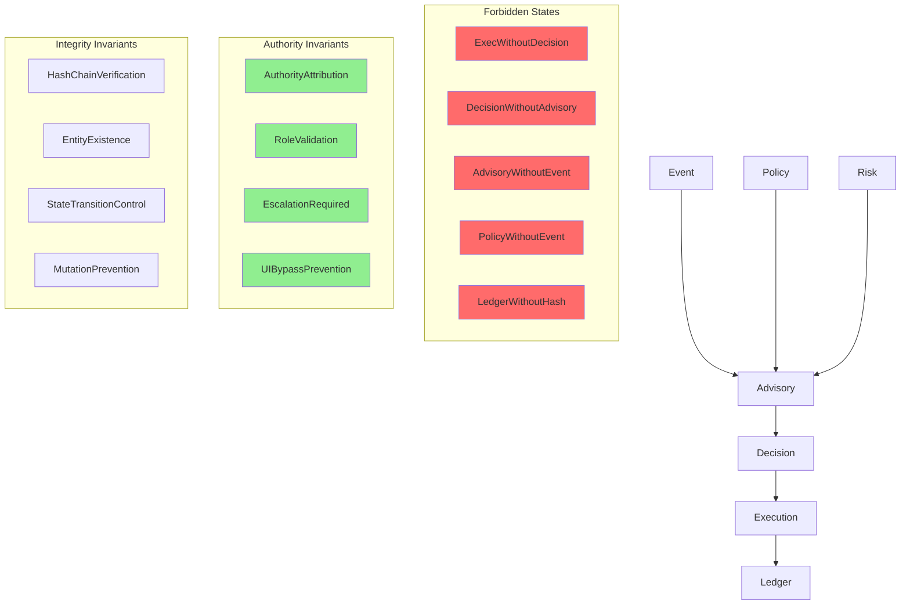

# Phase 9: Data Invariants & Constraint Lockdown

## SentinelOps Governance Backbone

---

## Objective

**Define:**

- **Non negotiable truths**
- **Forbidden states**
- **Authority breach conditions**
- **Integrity violations**
- **Architectural failure conditions**

**These invariants operate at:**

- **Domain level**
- **Cross domain level**
- **Authority level**
- **Ledger level**

---

## I. Event Domain Invariants

### EventID must be globally unique

**Event cannot transition backwards in state.**

**Event payload cannot be modified after normalization.**

**No Advisory may exist without a valid Event.**

**Violation Impact:**
**Compliance evaluation integrity compromised.**

---

## II. Policy Domain Invariants

### Only one Active version per PolicyID

**Active Policy cannot be modified.**

**Deprecated Policy must remain queryable for historical evaluation.**

**Advisory must reference exact Policy version used during evaluation.**

**Violation Impact:**
**Audit replay becomes unreliable.**

---

## III. Risk Domain Invariants

### Only one active RiskModel per evaluation context

**RiskAssessment cannot exist without Event reference.**

**RiskAssessment immutable after creation.**

**Advisory must record RiskLevel produced at evaluation time.**

**Violation Impact:**
**Inconsistent severity justification.**

---

## IV. Advisory Domain Invariants

### Advisory cannot exist without Event and PolicyVersion

**Advisory content immutable after Generated.**

**AdvisoryVersion must increment if regenerated.**

**Advisory cannot be edited after being referenced by a Decision.**

**Violation Impact:**
**Human authority decisions become defenseless.**

---

## V. Decision Domain Invariants

### Decision cannot exist without Advisory

### Only one Finalized decision per Advisory

### Override requires explicit Justification

### Finalized decision immutable

### Execution cannot be triggered without Finalized Approved Decision

**Violation Impact:**
**Authority bypass.**

---

## VI. Execution Domain Invariants

### Execution cannot exist without Approved Decision

### ExecutionStatus immutable once Logged

### Execution must produce Ledger entry

### ExecutionCommand must be preserved for audit trace

**Violation Impact:**
**Operational trace gap.**

---

## VII. Ledger Domain Invariants

### Ledger is append only

### No update allowed

### No delete allowed

### PreviousHash must match prior entry

### Hash chain must be verifiable end to end

### Ledger entry must reference a valid entity ID

**Violation Impact:**
**Regulatory failure.**

---

## VIII. Cross Domain Invariants

### No Execution without Decision

### No Decision without Advisory

### No Advisory without Policy evaluation

### No policy evaluation without Event

### No ledger entry without hash integrity

### No state transition without authority validation

**Violation Impact:**
**Governance collapse.**

---

## IX. Authority Invariants

### System must not auto execute actions

### All authority must be attributed to a role

### Escalation must produce new Decision entry

### UI must not bypass Decision Governance service

**Violation Impact:**
**Governance collapse.**

---

## X. Degradation Invariants

### If Policy Engine unavailable

### Execution must halt

### Ledger unavailable

### Risk Engine unavailable

**Then:**
**Fail safe always preferred over partial execution.**

---

## XI. Audit Replay Invariant

### For any LedgerEntry chain

**It must be possible to reconstruct:**

```
Event → PolicyVersion → RiskLevel → Advisory → Decision → Execution → Ledger
```

**If any link missing, system integrity failed.**

---

## XII. Formal Invariant Summary Diagram

### Invariant Rule Flow





### Invariant Enforcement Matrix

| Invariant | Enforcement Point | Detection Method | Recovery Action |
|-----------|------------------|----------------|---------------|
| **Event Uniqueness** | Event creation | Database constraint | Reject duplicate |
| **Policy Immutability** | Policy modification | Application lock | Prevent change |
| **Risk Assessment Integrity** | Risk creation | Event reference validation | Reject orphan |
| **Advisory Immutability** | Advisory modification | Version increment | Prevent change |
| **Decision Authority** | Decision creation | Advisory reference validation | Reject unauthorized |
| **Execution Control** | Execution trigger | Decision validation | Halt execution |
| **Ledger Immutability** | Ledger modification | Hash validation | Reject mutation |
| **Cross-Domain Integrity** | State transition | Dependency validation | Reject invalid |

---

## XIII. Constraint Implementation Strategies

### Database Level Constraints

```sql
-- Event uniqueness
ALTER TABLE event ADD CONSTRAINT uk_event_unique 
    UNIQUE (event_id, source_system, event_type, occurred_at);

-- Policy version control
ALTER TABLE policy ADD CONSTRAINT chk_policy_single_active 
    CHECK (status = 'Active' OR (updated_at IS NULL));

-- Advisory version control
ALTER TABLE advisory ADD CONSTRAINT chk_advisory_version_control 
    CHECK (advisory_version > 0 AND created_at = updated_at);

-- Decision finalization lock
ALTER TABLE decision ADD CONSTRAINT chk_decision_finalization 
    CHECK (finalized_at IS NOT NULL OR finalized_at > created_at);

-- Ledger append only
ALTER TABLE ledger_entry ADD CONSTRAINT chk_ledger_append_only 
    CHECK (entry_type = 'APPEND');
```

### Application Level Validation

```java
public class InvariantValidator {
    
    public void validateEventUniqueness(Event event) {
        if (eventRepository.existsBySourceAndType(event)) {
            throw new EventUniquenessViolation(
                "Duplicate event detected for source: " + event.getSourceSystem()
            );
        }
    }
    
    public void validatePolicyVersionControl(Policy policy) {
        if (policy.getStatus().equals("Active") && 
            policyRepository.hasActiveVersion(policy.getPolicyId())) {
            throw new PolicyModificationViolation(
                "Cannot modify active policy version"
            );
        }
    }
    
    public void validateAdvisoryImmutability(Advisory advisory) {
        if (advisory.getVersion() > 1 && 
            advisoryRepository.isReferencedByDecision(advisory.getAdvisoryId())) {
            throw new AdvisoryModificationViolation(
                "Cannot modify referenced advisory"
            );
        }
    }
}
```

### System Level Monitoring

```java
public class GovernanceMonitor {
    
    @Scheduled(fixedRate = 60000) // Every minute
    public void checkInvariantViolations() {
        // Monitor for forbidden states
        // Alert on integrity violations
        // Track governance health
    }
}
```

---

## XIV. Governance Failure Modes

### Safe Mode Operations

```yaml
degraded_mode:
  policy_engine: "read_only"
  risk_engine: "cached_scores_only"
  advisory_engine: "reduced_justification"
  decision_governance: "escalation_required"
  ledger: "read_only"
  execution_bridge: "disabled"
```

### Emergency Shutdown

```yaml
emergency_shutdown:
  trigger: "critical_integrity_violation"
  action: "immediate_halt_all_operations"
  recovery: "manual_intervention_required"
```

---

## XV. Validation Criteria

The invariant system is valid if:

- **All invariants are explicitly defined and enforced**
- **Forbidden states have detection mechanisms**
- **Authority breaches have prevention controls**
- **Integrity violations have recovery procedures**
- **Degradation modes are safe by default**
- **Audit replay is always possible**
- **Cross-domain invariants are architecturally prevented**

---

## XVI. Next Phase Preparation

This invariant system establishes the foundation for:

- **Phase 10:** End-to-end traceability validation
- **Phase 11-14:** Implementation respecting invariant constraints
- **Phase 15:** Production deployment with governance monitoring

---

## Data Invariants Summary

**This Phase 9 data invariants and constraint lockdown establishes the mathematical and logical constraints that make SentinelOps governance provably correct, ensuring that forbidden states are impossible, authority breaches are prevented, and system integrity is maintained through architectural enforcement rather than operational procedures.**

---

*This Phase 9 invariants and constraint lockdown defines the mathematical foundation of SentinelOps governance, establishing non-negotiable truths and enforcement mechanisms that will be validated through all subsequent implementation phases.*
