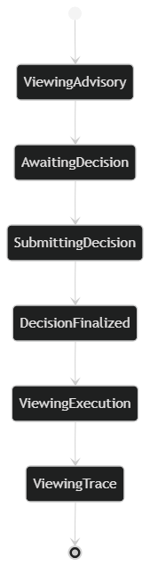
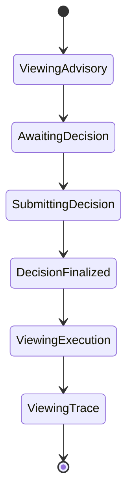
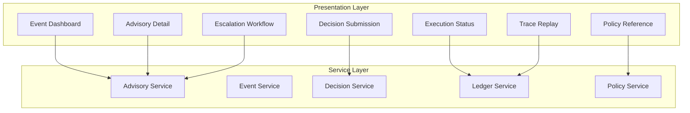

# Phase 11: UI Architecture Definition

## SentinelOps Governance Backbone

---

## Objective

**Define:**

- **What UI is allowed to do**
- **What UI is explicitly forbidden from doing**
- **UI to backend contracts**
- **Authority boundaries in presentation layer**

**UI must never contain business logic.**
**UI must never evaluate policy.**
**UI must never mutate canonical records directly.**

---

## 1. UI Architectural Positioning

### The Administrative Decision Surface is:

**A rendering and interaction layer.**

**It does not:**

- **Evaluate compliance**
- **Compute risk**
- **Generate advisory**
- **Write to ledger**
- **Execute actions directly**

**It only:**

- **Displays system generated information**
- **Collects explicit human decision**
- **Sends decision to Governance Service**

---

## 2. UI Responsibility Model

### UI is responsible for:

**Displaying Advisory**

**Displaying Policy references**

**Displaying Risk classification**

**Displaying full decision trace**

**Capturing Decision input**

**Displaying execution outcome**

**Displaying escalation workflow**

### UI is not responsible for:

- **Validating policy logic**
- **Calculating risk**
- **Deciding escalation automatically**
- **Persisting canonical data**

---

## 3. UI to Backend Contracts

### All UI actions must pass through explicit APIs.

#### Read APIs

- **GetEventByID**
- **GetAdvisoryByID**
- **GetDecisionTrace**
- **GetLedgerTrace**
- **GetPolicyVersion**

**These are read only.**

#### Write APIs

**Only one write entry point exists:**

**SubmitDecision**

**Payload must include:**

- **AdvisoryID**
- **DecisionType**
- **Justification**
- **EscalationFlag if applicable**

**No other write allowed from UI.**

---

## 4. UI Authority Model

### Authority is not granted by frontend logic.

**Authority is validated by Decision Governance service.**

**Even if UI tries to fake role, backend rejects.**

**UI may display available actions based on role, but backend enforces authority.**

---

## 5. UI State Modeling

### UI state mirrors backend state.

**UI must represent:**

#### Advisory State:

- **Generated**
- **Awaiting Decision**
- **Escalated**
- **Finalized**

#### Decision State:

- **Pending**
- **Approved**
- **Rejected**
- **Escalated**
- **Override**

#### Execution State:

- **Requested**
- **Dispatched**
- **Acknowledged**

#### Ledger State:

- **Committed**
- **Sealed**

**UI cannot create new states.**


### UI State Machine




**No path allows bypass of backend validation.**

---

## 6. UI Information Architecture

### Primary Screens:

#### Event Dashboard

#### Advisory Detail View

#### Decision Submission Panel

#### Escalation Workflow View

#### Execution Status View

#### Full Trace Replay View

#### Policy Reference View

**Each screen pulls from backend.**

**No local computation of compliance logic.**

---

## 7. UI Security Boundaries

### UI must enforce:

- **Role based display filtering**
- **No exposure of inactive policies**
- **No ability to edit historical records**
- **No direct ledger interaction**

**Critical rule:**

**UI cannot trigger execution endpoint.**

**Only Decision Governance can trigger Execution Bridge after ledger commit.**

---

## 8. UI Failure Behavior

### If:

- **Policy engine unavailable**
- **Ledger unavailable**
- **Risk engine unavailable**

### UI must:

- **Display degraded mode**
- **Disable decision submission**
- **Show compliance unavailable warning**

**UI must not allow submission when system in unsafe state.**

---

## 9. UI Audit Trace Support

### Trace View must allow:

**Replay by:**

- **EventID**
- **AdvisoryID**
- **DecisionID**

### Trace must show:

- **Policy version used**
- **Risk model version used**
- **Decision role**
- **Ledger hash entries**

**UI must not recompute trace.**
**It must request reconstructed trace from backend.**

---

## 10. API Contract Definitions

### Read Operations

```typescript
interface AdvisoryService {
    getAdvisoryByID(advisoryId: string): Promise<Advisory>;
    getDecisionTrace(advisoryId: string): Promise<DecisionTrace>;
    getPolicyVersion(policyId: string, version: number): Promise<Policy>;
}

interface EventService {
    getEventByID(eventId: string): Promise<Event>;
}

interface LedgerService {
    getLedgerTrace(entityId: string): Promise<LedgerEntry[]>;
}
```

### Write Operations

```typescript
interface DecisionService {
    submitDecision(request: DecisionSubmissionRequest): Promise<DecisionSubmissionResponse>;
}

interface DecisionSubmissionRequest {
    advisoryId: string;
    decisionType: 'Approve' | 'Reject' | 'Override' | 'Escalate';
    justification: string;
    escalationFlag?: boolean;
    decisionMakerRole: string;
}
```

---

## 11. UI Component Architecture

### Component Hierarchy



### Data Flow Constraints

```mermaid
flowchart LR
    UI -- "Read Only" --> Backend
    Backend -- "Decision Response" --> UI
    UI -. "No Direct Write" --> Ledger
    UI -. "No Policy Evaluation" --> PolicyEngine
    UI -. "No Risk Calculation" --> RiskEngine
```

---

## 12. UI Security Model

### Authentication & Authorization

```typescript
interface UserContext {
    userId: string;
    role: 'SeniorAdmin' | 'Admin' | 'Auditor' | 'Viewer';
    permissions: Permission[];
}

interface Permission {
    resource: 'advisory' | 'decision' | 'trace' | 'policy';
    action: 'read' | 'submit' | 'escalate';
}
```

### Role-Based Access Control

| Role | Advisory | Decision | Trace | Policy | Execution |
|-------|----------|----------|--------|--------|------------|
| **SeniorAdmin** | Read, Submit | Read, Submit | Read | Read | Read |
| **Admin** | Read, Submit | Read, Submit | Read | Read | Read |
| **Auditor** | Read | Read | Read | Read | Read |
| **Viewer** | Read | Read | Read | Read | Read |

---

## 13. UI Performance Requirements

### Response Time Targets

| Operation | Target | Maximum |
|-----------|---------|----------|
| **Advisory Load** | < 500ms | 1s |
| **Decision Submit** | < 200ms | 500ms |
| **Trace Replay** | < 1s | 2s |
| **Event Dashboard** | < 300ms | 750ms |

### Caching Strategy

```typescript
interface CacheConfig {
    advisoryTTL: 300000; // 5 minutes
    policyTTL: 600000; // 10 minutes
    traceTTL: 1800000; // 30 minutes
}
```

---

## 14. UI Error Handling

### System Unavailable States

```typescript
enum SystemStatus {
    HEALTHY = 'healthy',
    DEGRADED = 'degraded',
    UNAVAILABLE = 'unavailable'
}

interface UIState {
    systemStatus: SystemStatus;
    availableActions: Action[];
    warnings: Warning[];
}
```

### Error Recovery

```typescript
class ErrorHandler {
    handleSystemUnavailable(status: SystemStatus) {
        switch(status) {
            case SystemStatus.DEGRADED:
                this.showDegradedModeWarning();
                this.disableNonCriticalActions();
                break;
            case SystemStatus.UNAVAILABLE:
                this.showUnavailableMessage();
                this.disableAllActions();
                break;
        }
    }
}
```

---

## 15. What This Phase Guarantees

### UI cannot:

- **Bypass authority**
- **Mutate canonical data**
- **Modify ledger**
- **Execute actions**
- **Recalculate compliance**

### UI can only:

- **Display**
- **Collect**
- **Submit**

**That protects governance integrity.**

---

## Validation Criteria

The UI architecture is valid if:

- **All business logic remains in backend services**
- **UI has no direct database access**
- **Authority is validated by backend, not frontend**
- **State machine prevents bypass operations**
- **API contracts are strictly enforced**
- **Security boundaries are maintained**
- **Failure modes are safe by default**
- **Audit trace support is complete**

---

## Next Phase Preparation

This UI architecture establishes foundation for:

- **Phase 12:** Implementation respecting UI constraints
- **Phase 13-14:** Production deployment with monitoring
- **Phase 15:** Regulatory compliance certification

---

## UI Architecture Summary

**This Phase 11 UI architecture definition establishes clear boundaries between presentation and business logic, ensuring that the frontend cannot bypass governance controls, mutate canonical data, or execute actions without proper authority validation through backend enforcement.**

---

*This Phase 11 UI architecture definition creates the governance-safe presentation layer that maintains human authority while preventing any possibility of frontend-based system bypass or data corruption.*
