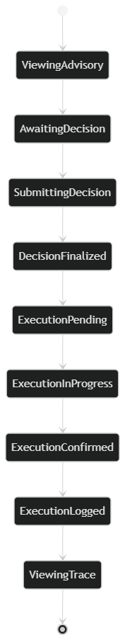
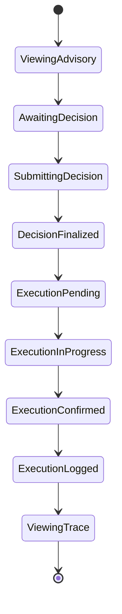

# Phase 12: UI State Modeling

## SentinelOps Governance Backbone

---

## Objective

**Define:**

- **All UI states**
- **State transitions**
- **Authority enabled states**
- **Read only states**
- **Degraded states**
- **Forbidden UI states**

**UI state must be a projection of backend state.**

**UI must never invent state.**

---

## 1. Core UI State Dimensions

### UI state is derived from four backend domains:

**Advisory State**

**Decision State**

**Execution State**

**System Health State**

**The UI state space is a combination of these.**

---

## 2. Advisory State Mapping

### Backend Advisory States:

- **Generated**
- **Presented**
- **Referenced**

### UI Representation:

```
Generated → Awaiting Decision Screen
Presented → Viewing Advisory
Referenced → Locked Advisory View
```

### Rules:

**If Advisory referenced by Decision:**
**UI must disable editing and decision submission.**

---

## 3. Decision State Mapping

### Backend Decision States:

- **Pending**
- **Approved**
- **Rejected**
- **Escalated**
- **Finalized**

### UI Authority Rules:

#### Pending:
- **Show Approve**
- **Show Reject**
- **Show Escalate**

#### Approved:
- **Disable decision buttons**
- **Show execution progress**

#### Rejected:
- **Disable decision buttons**
- **Show closure**

#### Escalated:
- **Hide approval options for current role**
- **Display awaiting higher authority**

#### Finalized:
- **All controls disabled**
- **Trace view enabled**

---

## 4. Execution State Mapping

### Backend Execution States:

- **Requested**
- **Dispatched**
- **Acknowledged**
- **Logged**

### UI Mapping:

```
Requested → Execution Pending
Dispatched → Execution In Progress
Acknowledged → Execution Confirmed
Logged → Execution Finalized
```

**No execution state may be triggered from UI directly.**

---

## 5. System Health States

### Derived from infrastructure:

- **Healthy**
- **Degraded**
- **Unsafe**

### Rules:

#### If Unsafe:
- **Disable decision submission**
- **Display system integrity warning**

#### If Degraded:
- **Allow read only**
- **Allow escalation only if ledger available**

**UI must not allow decision submission if ledger unavailable.**

---

## 6. Full UI State Machine

### Complete State Flow





### State Transitions Allowed Only If:

**Backend confirms previous state.**

**UI must poll or subscribe to backend events.**

---

## 7. Authority Enabled State Matrix

| UI State | Can Approve | Can Reject | Can Escalate | Read Only |
|------------|---------------|------------|--------------|-----------|
| **AwaitingDecision** | Yes | Yes | Yes | No |
| **Escalated** | No | No | No | Yes |
| **Approved** | No | No | No | Yes |
| **Rejected** | No | No | No | Yes |
| **ExecutionInProgress** | No | No | No | Yes |
| **UnsafeSystem** | No | No | No | Yes |

**This matrix must be enforced in UI and validated in backend.**

---

## 8. Forbidden UI States

### These states must never exist:

- **Decision buttons visible after Finalized**
- **Execution status displayed before Decision**
- **Advisory editable after Decision**
- **Escalation option visible for insufficient role**
- **Submission enabled during ledger failure**

**If these appear, it is architectural breach.**

---

## 9. Degraded Mode UI Flow

### If Policy Engine fails:

**UI must display:**

```
Compliance Evaluation Unavailable
Decision submission disabled.
```

### If Ledger fails:

**UI must display:**

```
Decision recording unavailable. Execution blocked.
```

**No silent fallback.**

---

## 10. UI Replay State

### Trace View must allow:

**Replay of lifecycle states in order:**

```
Event → Risk → Advisory → Decision → Execution → Ledger
```

### UI must display state transitions chronologically.

**No synthetic state creation.**

---

## 11. State Implementation Architecture

### State Management Pattern

```typescript
interface UIState {
    advisory: AdvisoryState;
    decision: DecisionState;
    execution: ExecutionState;
    systemHealth: SystemHealthState;
    userRole: UserRole;
    availableActions: Action[];
}

class StateManager {
    private state: UIState;
    
    updateState(newState: Partial<UIState>) {
        // Only update if backend confirms
        if (this.validateTransition(newState)) {
            this.state = { ...this.state, ...newState };
            this.notifyStateChange();
        }
    }
    
    private validateTransition(newState: Partial<UIState>): boolean {
        return this.backendService.confirmStateTransition(
            this.state, newState
        );
    }
}
```

### State Persistence

```typescript
interface StateStore {
    saveState(state: UIState): Promise<void>;
    restoreState(): Promise<UIState>;
    subscribe(callback: (state: UIState) => void): void;
}
```

---

## 12. State Validation Rules

### Advisory State Rules

```typescript
class AdvisoryStateValidator {
    validateTransition(from: AdvisoryState, to: AdvisoryState): boolean {
        if (from === 'Referenced' && to !== 'Referenced') {
            return false; // Cannot exit referenced state
        }
        
        if (to === 'Generated' && from !== 'Presented') {
            return false; // Only backend can generate
        }
        
        return true;
    }
}
```

### Decision State Rules

```typescript
class DecisionStateValidator {
    validateTransition(from: DecisionState, to: DecisionState, role: UserRole): boolean {
        if (to === 'Pending' && role !== 'SeniorAdmin') {
            return false; // Only admins can initiate
        }
        
        if (from === 'Finalized' && to !== 'Finalized') {
            return false; // Cannot exit finalized state
        }
        
        return true;
    }
}
```

---

## 13. State Synchronization

### Backend Event Subscription

```typescript
interface BackendEvent {
    entityType: 'advisory' | 'decision' | 'execution';
    entityId: string;
    newState: string;
    timestamp: Date;
}

class StateSynchronizer {
    subscribeToBackendEvents() {
        this.eventStream.subscribe((event: BackendEvent) => {
            this.stateManager.updateState({
                [event.entityType]: event.newState
            });
        });
    }
}
```

### Polling Strategy

```typescript
class StatePoller {
    pollState() {
        setInterval(async () => {
            const currentState = await this.getStateFromBackend();
            this.stateManager.updateState(currentState);
        }, 5000); // Every 5 seconds
    }
}
```

---

## 14. Error State Handling

### State Recovery

```typescript
class StateErrorHandler {
    handleStateError(error: StateError) {
        switch(error.type) {
            case 'INVALID_TRANSITION':
                this.showTransitionError();
                this.rollbackToLastValidState();
                break;
            case 'BACKEND_UNAVAILABLE':
                this.enterDegradedMode();
                break;
            case 'AUTHORITY_VIOLATION':
                this.showAuthorityError();
                this.blockAllActions();
                break;
        }
    }
}
```

---

## 15. What Phase 12 Guarantees

### • No UI state ambiguity

### • No authority leakage via presentation

### • No accidental reactivation of closed decisions

### • No bypass of escalation rules

### • No execution trigger from UI

**UI is now fully constrained.**

---

## 16. Validation Criteria

The UI state modeling is valid if:

- **All states are projections of backend state**
- **State transitions are validated by backend**
- **Authority matrix is enforced in UI and backend**
- **Forbidden states are architecturally prevented**
- **Degraded modes are safe by default**
- **State synchronization is reliable**
- **Error handling prevents invalid transitions**

---

## Next Phase Preparation

This UI state modeling establishes foundation for:

- **Phase 13:** Implementation respecting state constraints
- **Phase 14-15:** Production deployment with monitoring
- **Phase 16:** Regulatory compliance certification

---

## UI State Modeling Summary

**This Phase 12 UI state modeling defines the complete state space for SentinelOps presentation layer, ensuring that UI states are always projections of backend state, transitions are validated, authority is enforced, and forbidden states are architecturally prevented.**

---

*This Phase 12 UI state modeling creates a mathematically bounded state machine that guarantees governance integrity through backend validation and prevents any possibility of frontend-based state corruption or authority bypass.*
