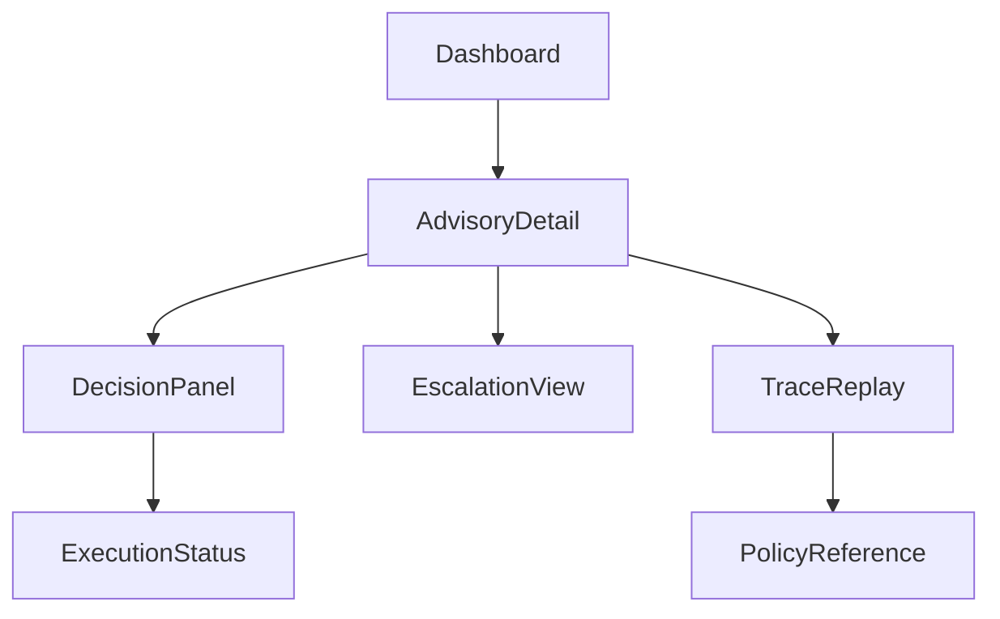
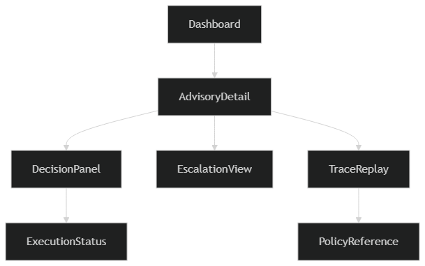
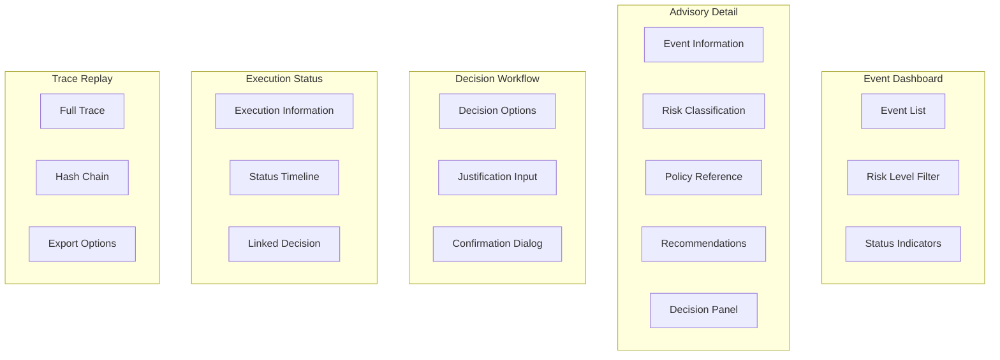

# Phase 13: UI Information Architecture

## SentinelOps Governance Backbone

---

## Objective

**Define:**

- **Screen inventory**
- **Information placement**
- **Action placement**
- **Authority visibility**
- **Trace visibility**
- **Escalation visibility**

**UI must make:**

**Risk visible**
**Policy visible**
**Authority visible**
**Trace visible**

**No hidden decision making.**

---

## 1. Screen Inventory

### SentinelOps Administrative Surface consists of:

#### Event Overview Dashboard

#### Advisory Detail View

#### Decision Panel

#### Escalation Workflow View

#### Execution Status View

#### Trace Replay View

#### Policy Reference View

#### System Health Panel

**Each screen has a governance purpose.**

---

## 2. Event Overview Dashboard

### Purpose:

**Provide prioritized view of events requiring governance attention.**

### Displays:

- **EventID**
- **SourceSystem**
- **RiskLevel**
- **Advisory Status**
- **Decision Status**
- **Escalation Indicator**
- **Timestamp**

### Sorting:

**Default sorted by RiskLevel descending.**

**No action buttons here.**

**Only navigation to Advisory Detail.**

---

## 3. Advisory Detail View

### Purpose:

**Full compliance context before decision.**

### Layout Sections:

#### Top Section:
- **Event Summary**
- **Risk Classification**
- **Risk Score**
- **Policy Reference**

#### Middle Section:
- **Recommendation Options**
- **Justification Text**
- **Policy Version Used**

#### Bottom Section:
- **Decision Panel**

### Advisory content locked if referenced by Decision.

---

## 4. Decision Panel

### Purpose:

**Explicit authority input.**

### Displays:

- **Approve**
- **Reject**
- **Escalate**
- **Override**

### Each action requires:

- **Confirmation**
- **Justification field if override**
- **Display of role identity**

### No silent submission allowed.

### Submission must show:

**Decision will be permanently recorded.**

---

## 5. Escalation Workflow View

### Purpose:

**Display escalation chain.**

### Shows:

- **Current authority holder**
- **Required next authority**
- **Escalation timestamp**
- **Prior decisions**

### Escalation cannot be hidden.

---

## 6. Execution Status View

### Purpose:

**Display operational outcome.**

### Shows:

- **Target system**
- **Execution status**
- **Timestamps**
- **Linked Decision**

### Execution panel has no control buttons.

**Read only.**

---

## 7. Trace Replay View

### Purpose:

**Full lifecycle replay.**

### Chronological display:

```
Event

Risk Assessment

Policy Evaluation

Advisory

Decision

Execution

Ledger entries with hash
```

### Hash values displayed for regulator visibility.

### Trace must be exportable.

---

## 8. Policy Reference View

### Purpose:

**Allow administrators to understand policy basis.**

### Displays:

- **PolicyID**
- **Version**
- **Conditions**
- **Regulatory references**
- **Activation date**

### No editing allowed here.

**Editing only available in Policy Management interface separate from Decision surface.**

---

## 9. System Health Panel

### Purpose:

**Display system integrity.**

### Indicators:

- **Policy Engine Status**
- **Risk Engine Status**
- **Ledger Integrity Status**
- **Execution Bridge Status**

### If any critical service down:

**Decision panel disabled.**

**Visible warning banner.**

---

## 10. Information Placement Principles

### Governance Priority:

**Risk and Policy displayed above Decision controls.**

### Decision controls never appear without:

- **Risk visible**
- **Policy reference visible**

### No decision made in blind state.

---

## 11. Navigation Structure

### Linear and transparent flow.



### No hidden shortcuts.

---

## 12. Screen Layout Architecture


### Component Hierarchy



### Responsive Design

```typescript
interface ScreenLayout {
    desktop: LayoutConfig;
    tablet: LayoutConfig;
    mobile: LayoutConfig;
}

interface LayoutConfig {
    primaryNavigation: 'sidebar' | 'topbar';
    contentArea: 'single' | 'split';
    actionPanel: 'fixed' | 'modal';
}
```

---

## 13. Information Hierarchy

### Visual Priority Levels

1. **Critical Information** (Red/Alert)
   - Risk Level: High
   - System Health: Critical
   - Escalation Required

2. **Important Information** (Orange/Warning)
   - Risk Level: Medium
   - Decision Pending
   - Execution In Progress

3. **Standard Information** (Blue/Normal)
   - Risk Level: Low
   - Decision Approved
   - Execution Completed

4. **Reference Information** (Gray/Secondary)
   - Policy Details
   - Historical Data
   - System Logs

---

## 14. Data Display Rules

### Risk Classification Display

```typescript
interface RiskDisplay {
    level: 'Critical' | 'High' | 'Medium' | 'Low';
    color: string;
    icon: string;
    priority: number;
}

const riskDisplayConfig: RiskDisplay[] = [
    { level: 'Critical', color: '#dc3545', icon: 'critical', priority: 1 },
    { level: 'High', color: '#fd7e14', icon: 'high', priority: 2 },
    { level: 'Medium', color: '#ffc107', icon: 'medium', priority: 3 },
    { level: 'Low', color: '#28a745', icon: 'low', priority: 4 }
];
```

### Status Indicators

```typescript
interface StatusIndicator {
    status: 'Pending' | 'In Progress' | 'Completed' | 'Failed';
    display: {
        text: string;
        color: string;
        animation?: string;
    };
}
```

---

## 15. Action Placement Strategy

### Decision Action Panel

```typescript
interface ActionPanel {
    actions: Action[];
    layout: 'horizontal' | 'vertical';
    confirmation: 'inline' | 'modal';
}

interface Action {
    id: string;
    type: 'primary' | 'secondary' | 'warning';
    label: string;
    requiresJustification: boolean;
    enabled: boolean;
}
```

### Action Visibility Rules

```typescript
class ActionVisibilityController {
    determineActions(state: UIState, userRole: UserRole): Action[] {
        const baseActions = this.getBaseActions();
        
        if (state.advisory.referenced) {
            return this.getReadOnlyActions();
        }
        
        if (state.systemHealth !== 'Healthy') {
            return this.getDegradedActions();
        }
        
        return this.filterByRole(baseActions, userRole);
    }
}
```

---

## 16. Trace Information Architecture

### Trace Data Structure

```typescript
interface TraceEntry {
    timestamp: Date;
    entityType: 'Event' | 'Risk' | 'Policy' | 'Advisory' | 'Decision' | 'Execution' | 'Ledger';
    entityId: string;
    data: any;
    hash?: string;
}
```

### Trace Display Components

```typescript
interface TraceDisplay {
    timeline: TimelineComponent;
    details: DetailPanel;
    verification: HashVerificationComponent;
    export: ExportControls;
}
```

---

## 17. Governance Visibility Guarantees

### UI must guarantee:

- **Risk always visible before decision**
- **Policy version visible before decision**
- **Escalation visible before approval**
- **Ledger trace accessible after execution**
- **System health visible at all times**

### No decision made in blind state.

---

## 18. Validation Criteria

The UI information architecture is valid if:

- **All screens serve specific governance purposes**
- **Information hierarchy follows governance priority**
- **Action placement respects authority boundaries**
- **Navigation structure is transparent and linear**
- **Risk and policy information precede decision controls**
- **System health is always visible**
- **Trace information is complete and exportable**
- **No hidden decision pathways exist**

---

## Next Phase Preparation

This UI information architecture establishes foundation for:

- **Phase 14:** Implementation respecting information placement rules
- **Phase 15-16:** Production deployment with monitoring
- **Phase 17:** Regulatory compliance certification

---

## UI Information Architecture Summary

**This Phase 13 UI information architecture defines the complete screen inventory, information placement strategy, and governance visibility requirements for SentinelOps, ensuring that all decision-making contexts are fully visible, traceable, and compliant with authority boundaries.**

---

*This Phase 13 UI information architecture creates a transparent governance interface where risk, policy, and authority information are always visible before decisions, ensuring no blind decision making and complete audit trail visibility.*
